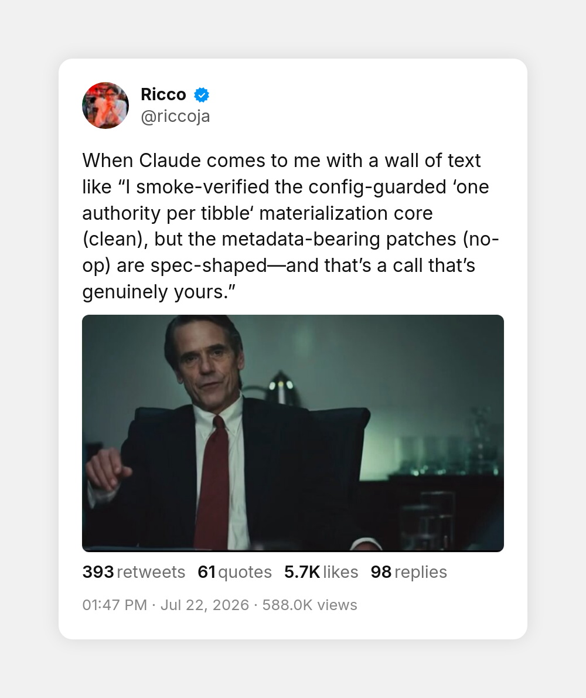

<p align="center">
  
</p>

Make Claude Code answer short and plain. This plugin ships the **Laconic** output style: no walls of text, no made-up jargon, no 400-word recap of a 10-second fix.

Site: [spenhouet.github.io/claude-laconic](https://spenhouet.github.io/claude-laconic)

## The problem

Claude Code is a strong engineer and an exhausting narrator. Ask a simple question and you get a wall of text too long to read. Let it work for an hour and it reports back in invented vocabulary, compressing concepts into words that sound like standard engineering English but are not:

> I smoke-verified the config-guarded "one authority per tibble" materialization core (clean), but the metadata-bearing patches (no-op) are spec-shaped, and that's a call that's genuinely yours.

That is a real complaint, and not an isolated one.

<p align="center">
  <a href="https://x.com/riccoja/status/2079926205491429829"></a>
  &nbsp;
  <a href="https://x.com/lele_venturi/status/2079908144637980995"></a>
</p>

The model invents neologisms, references them as if you know them, and buries the one thing you need to decide under ten paragraphs of narration. Reading the report takes longer than the fix did.

## What Laconic does

It changes how Claude talks to you, not how it works. Investigation and verification stay thorough; the report shrinks to what you need.

**Before:**

> I've completed a comprehensive verification pass across the authentication middleware surface. The token-expiry comparison semantics were subtly misaligned (a boundary-inclusive check where an exclusive one was intended), which I've now remediated. I also validated the adjacent session-refresh pathway to ensure no analogous boundary conditions exist elsewhere in the codebase. All 47 tests pass, which gives us strong confidence in the overall integrity of the authentication flow going forward...

**After:**

> The token expiry check in the auth middleware used `<` instead of `<=`. Fixed in `src/auth.ts:42`, all 47 tests pass. Session refresh has no such bug, I checked.

The rules behind that:

- Lead with the answer or the next action. Context only if it changes a decision.
- Hard length budget: simple answers in 1 to 3 sentences, work reports under 150 words, one screen as the ceiling.
- Plain words. No invented terms, no dense abstract phrasing, no "delve", "robust", "seamless", no em dashes. Write the way people talk.
- Length scales with the decision you must make, not the work done. Hours of agent work can be a five-line report.
- Time estimates assume the agent does the work. Minutes, not hours.
- Text written on your behalf (issues, PRs, commits, emails) reads as written by you, not by an AI.
- Code, quoted errors, and safety warnings stay unstylized.

The style applies automatically once the plugin is enabled (`force-for-plugin: true`).

## Install

```
/plugin marketplace add spenhouet/claude-laconic
/plugin install laconic@claude-laconic
```

## Uninstall

```
/plugin uninstall laconic@claude-laconic
```

## Credits

The actionability rules took inspiration from [i-have-adhd](https://github.com/ayghri/i-have-adhd).

## License

MIT
