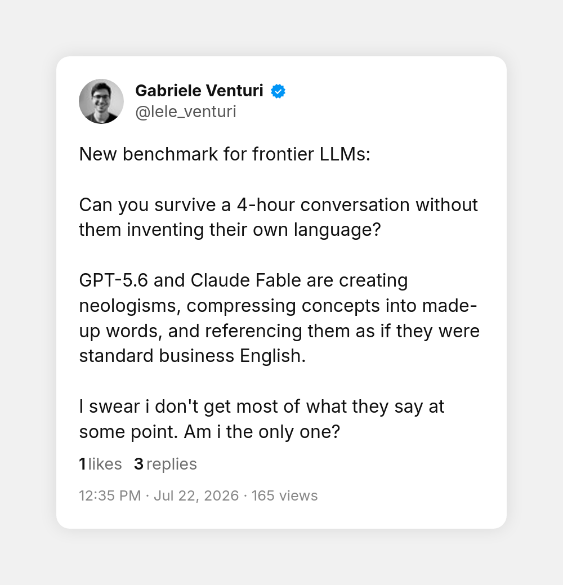
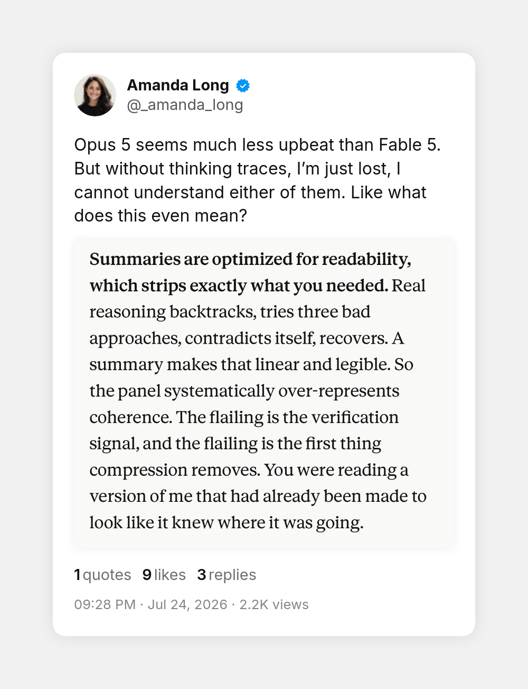
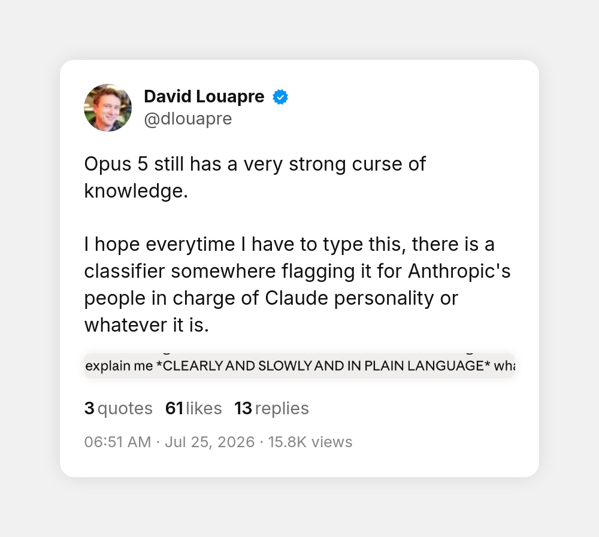
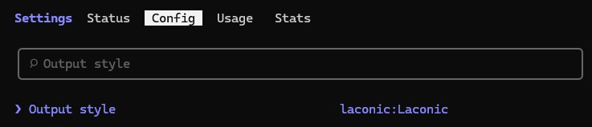

<p align="center">
  
</p>

**Claude says less, in words you know.** This plugin ships the **Laconic** output style: short answers in plain language, no walls of text, no made-up jargon, no 400-word recap of a 10-second fix.

The one-pager lives at [spenhouet.com/claude-laconic](https://spenhouet.com/claude-laconic).

## The problem

Claude Code is a strong engineer and an exhausting narrator. Ask a simple question and you get a wall of text too long to read. Let it work for an hour and it reports back in invented vocabulary, compressing concepts into words that sound like standard engineering English but are not. It buries the one thing you need to decide under ten paragraphs of narration, and reading the report takes longer than the fix did.

<details>
<summary><b>The problem, in their words</b> (four screenshots)</summary>
<br>
<p align="center">
  <a href="https://x.com/riccoja/status/2079926205491429829"></a>
  &nbsp;
  <a href="https://x.com/lele_venturi/status/2079908144637980995"></a>
</p>
<p align="center">
  <a href="https://x.com/_amanda_long/status/2080767058136945010"></a>
  &nbsp;
  <a href="https://x.com/dlouapre/status/2080908716002488411"></a>
</p>

The screenshots come from [@riccoja](https://x.com/riccoja/status/2079926205491429829), [@lele_venturi](https://x.com/lele_venturi/status/2079908144637980995), [@_amanda_long](https://x.com/_amanda_long/status/2080767058136945010) and [@dlouapre](https://x.com/dlouapre/status/2080908716002488411).

</details>

## Install

Two separate prompts in Claude Code. Send the first, then the second:

```
/plugin marketplace add spenhouet/claude-laconic
```

```
/plugin install laconic@claude-laconic
```

Then turn the style on:

```
/config
```

Open "Output style" and select "laconic:Laconic":



To remove it:

```
/plugin uninstall laconic@claude-laconic
```

## What Laconic does

It changes how Claude talks to you, not how it works. Investigation and verification stay thorough; the report shrinks to what you need.

**Before:**

> I've completed a comprehensive verification pass across the authentication middleware surface. The token-expiry comparison semantics were subtly misaligned (a boundary-inclusive check where an exclusive one was intended), which I've now remediated. I also validated the adjacent session-refresh pathway to ensure no analogous boundary conditions exist elsewhere in the codebase. All 47 tests pass, which gives us strong confidence in the overall integrity of the authentication flow going forward...

**After:**

> The token expiry check in the auth middleware used `<` instead of `<=`. Fixed in `src/auth.ts:42`, all 47 tests pass. Session refresh has no such bug, I checked.

Every rule behind that is in [output-styles/Laconic.md](output-styles/Laconic.md).

## Credits

The actionability rules took inspiration from [i-have-adhd](https://github.com/ayghri/i-have-adhd).

## License

MIT
